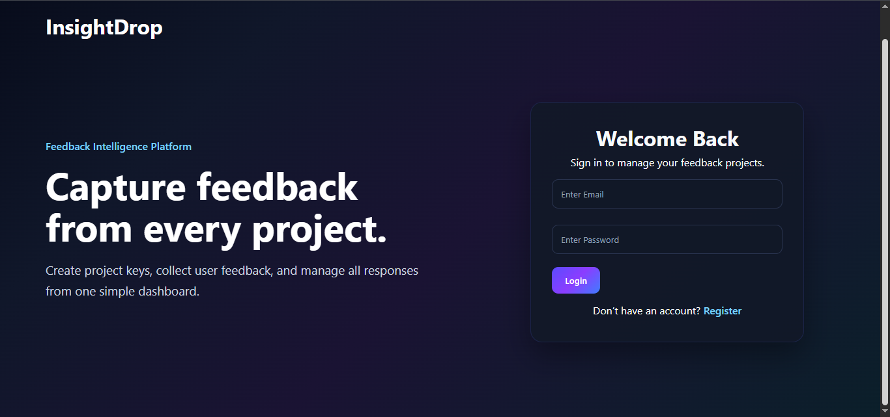
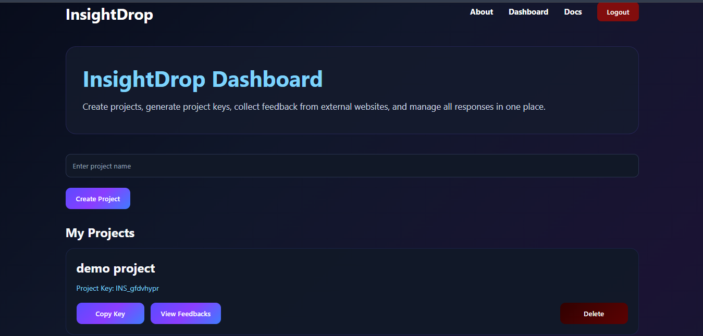
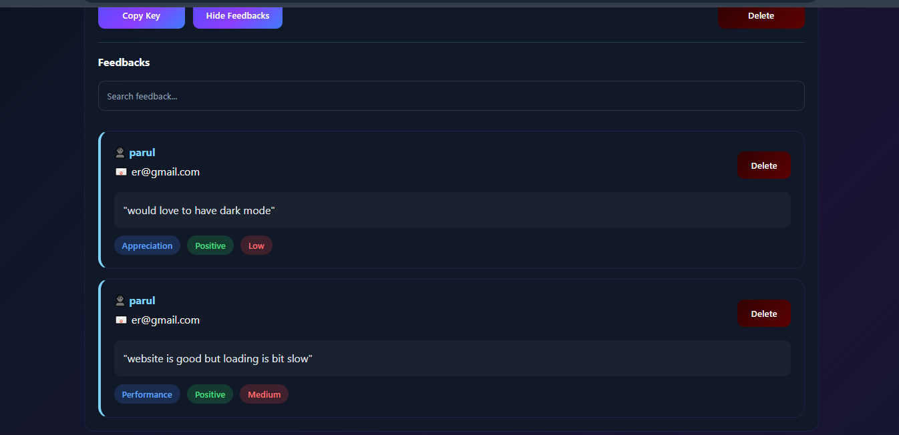
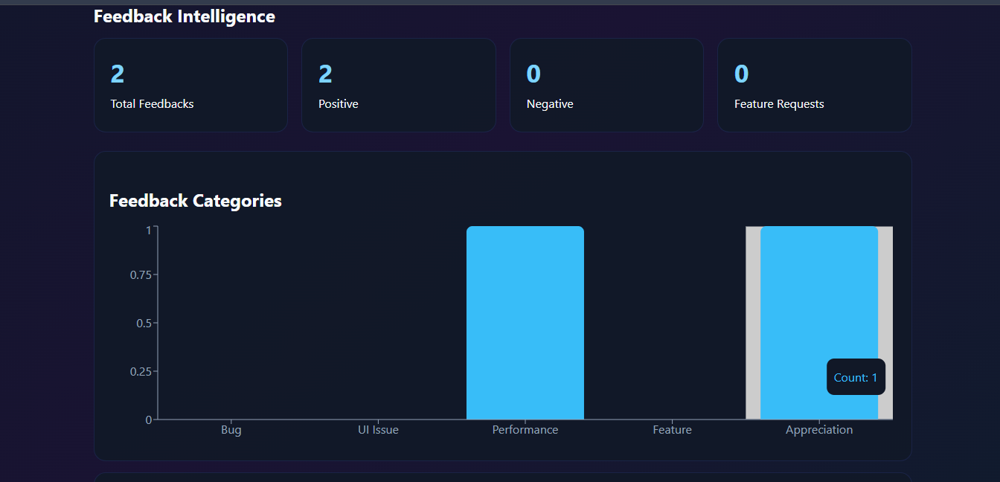
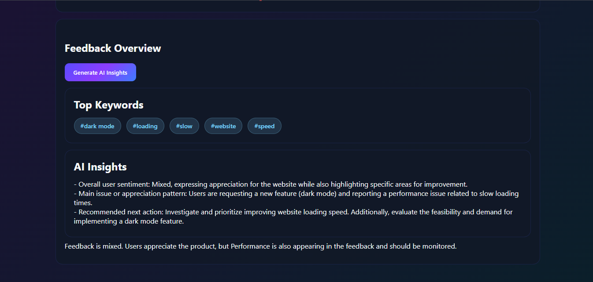
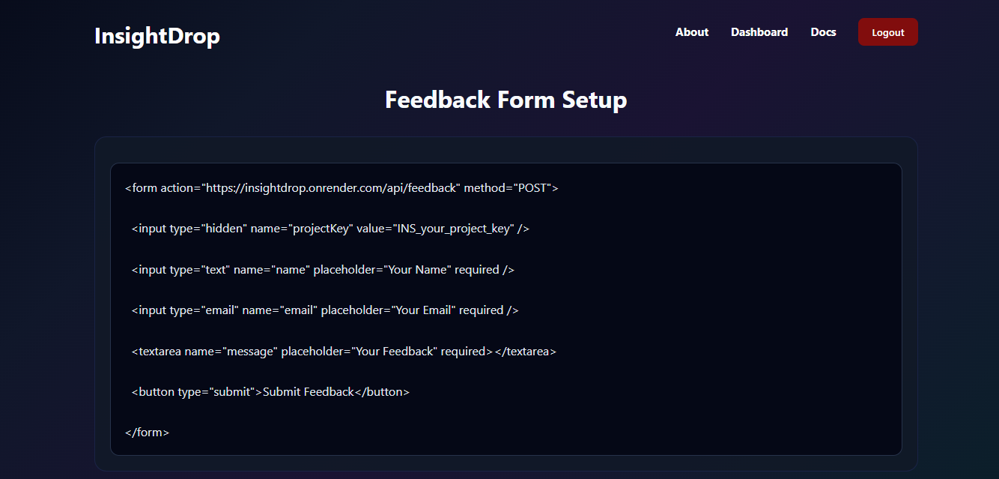
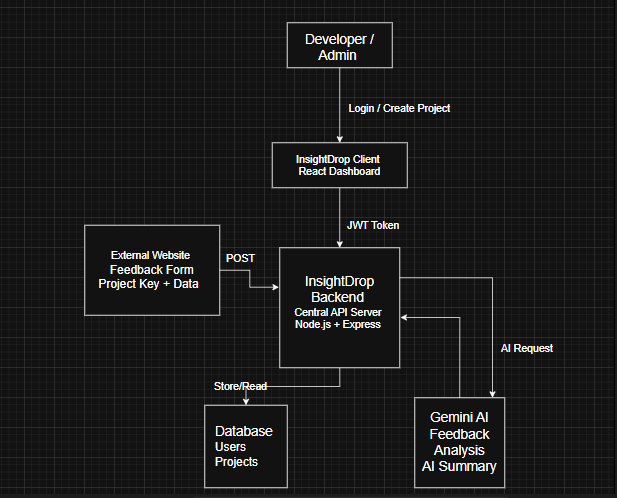

# 🚀 InsightDrop


InsightDrop is an AI-powered feedback management platform that helps developers collect, organize, and understand user feedback from websites and applications.

Instead of manually reading hundreds of feedback messages, InsightDrop provides sentiment analysis, feedback categorization, keyword extraction, and AI-powered insights to help developers quickly identify important patterns and make better product decisions.

---

## 🌐 Live Demo

**Frontend**  
https://insightdrop-saas.vercel.app

**Backend**  
https://insightdrop.onrender.com

---

## 📸 Screenshots

### 🏠 Landing Page



---

### 📊 Dashboard



---

### 💬 Feedback Management



---

### 📈 Analytics Dashboard



---

### 🤖 AI Insights



---

### ⚙️ Feedback Form Integration



---

## ✨ Features

- User Authentication
- Create Multiple Projects
- Unique Project Key Generation
- Feedback Collection
- Feedback Search
- Feedback Intelligence Dashboard
- Sentiment Analysis
- Feedback Categories
- AI-powered Feedback Insights
- AI-powered Keyword Extraction
- Feedback Form Integration Guide
- Responsive Dashboard

---

## 🛠 Tech Stack

### Frontend

- React.js
- Vite
- Axios
- CSS

### Backend

- Node.js
- Express.js
- MongoDB Atlas
- JWT Authentication

### AI

- Gemini API

### Deployment

- Vercel
- Render

---

## 📂 Project Workflow

1. User creates an account.
2. User creates a project.
3. A unique project key is generated.
4. External websites submit feedback using the generated project key.
5. Feedback is securely stored in MongoDB Atlas.
6. InsightDrop analyzes feedback using AI.
7. The dashboard visualizes feedback trends, sentiment analysis, categories, keyword extraction, and AI-generated insights.

---

## 📦 Installation

### Clone Repository

```bash
git clone https://github.com/parul-64/InsightDrop.git
```

### Install Backend

```bash
cd server
npm install
```

### Create `.env`

```env
MONGO_URI=your_mongodb_uri
JWT_SECRET=your_secret
GEMINI_API_KEY=your_api_key
```

### Run Backend

```bash
npm start
```

### Install Frontend

```bash
cd client
npm install
npm run dev
```

---

## 🏗 System Architecture

The architecture below shows how InsightDrop collects feedback from external websites, processes requests through the backend, stores data in MongoDB Atlas, and generates AI-powered insights using Gemini AI.



---

## 🔮 Future Improvements

- Team Collaboration
- Export Reports (PDF/CSV)
- Anonymous Feedback Collection
- Custom AI Models
- Email Notifications
- Public API Support

---

## 👩‍💻 Author

**Parul Sharma**

Built with ❤️ using React, Node.js, Express.js, MongoDB Atlas, and Gemini AI.